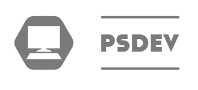

<p align="center">
  <a href="https://unform.dev">
    
  </a>
</p>

<h1 align="center">Contact Book API</h1>

## Descrição do Projeto
<p align="center">Api criada em NodeJS, para uso com o projeto Contact Book, usando REST API</p>

<p align="center">
 <a href="#featuares">Fearures</a> •
 <a href="#rodando-o-projeto">Rodando o Projeto</a> • 
 <a href="#tecnologias">Tecnologias</a> • 
 <a href="#nota">Nota</a> • 
 <a href="#auto">Autor</a> • 
</p>

<h4 align="center"> 
	🚧  Contact Book API 🚀 Em construção...  🚧
</h4>

### Features

- [x] Cadastro de Contatos
- [x] Buscar Contatos
- [x] Paginação de Contatos
- [x] Buscar Contatos por ID
- [x] Edição de Contatos
- [x] Exclusão de Contatos
- [x] Cadastro de Eventos
- [x] Edição de Eventos
- [x] Buscar Eventos
- [x] Paginação de Eventos
- [x] Buscar Evento por ID
- [x] Exclusão de Eventos
- [x] Adicionar Contatos a Eventos
- [x] Excluir Contatos de Eventos


## Rodando o Projeto

### Pré-requisitos

Antes de começar, você vai precisar ter instalado em sua máquina as seguintes ferramentas:
[Git](https://git-scm.com), [Node.js](https://nodejs.org/en/). 
Além disto é bom ter um editor para trabalhar com o código como [VSCode](https://code.visualstudio.com/)

### 🎲 Rodando o Back End (servidor)

```bash
# Clone este repositório
$ git clone <https://github.com/PatrickSoaresDev/contact-book-api>

# Acesse a pasta do projeto no terminal/cmd
$ cd contact-book-api

# Instale as dependências
$ npm install

# Execute a aplicação em modo de desenvolvimento
$ npm start

# O servidor inciará na porta:3000 - acesse <http://localhost:3000>

### Variáveis de ambiente 🔐
DB_NAME - Nome do banco de dados
DB_USER - Usuário do banco de dados
DB_PASSWORD - Senha do banco de dados
DB_HOST - IP Banco de dados
DB_POOL_MAX - Máximo de conexões
DB_POOL_MIN - Mínimo de conexões
DB_DIALECT - MYSQL
PORT - Porta a ser usada na aplicação, 3000 por padrão
NODE_ENV - Ambiente de trabalho

### Observação
# Para o uso das migrates, você deverá criar um arquivo config.json em "./src/database", e criar o arquivo a seguir com as informações do seu banco de dados.

{
  "//comentario:": "Arquivo usado para gerar migrations",
  "development": {
    "username": "root",
    "password": "******",
    "database": "contact_book",
    "host": "localhost",
    "dialect": "mysql"
  }
}

# Após isso, apenas rodar o comando: npx sequelize-cli db:migrate


```


### 🛠 Tecnologias

As seguintes ferramentas foram usadas na construção do projeto:

- [Node.js](https://nodejs.org/en/)
- [Express.js](https://expressjs.com/pt-br/)
- [axios](https://axios-http.com/ptbr/docs/intro)

## Nota

<h4>Inspirado no projeto do Victor Rafael</h4>
<a href="https://github.com/VictorRafael735">
 
 <br />
 <sub><b>Victor Rafael</b></sub></a> <a href="https://github.com/VictorRafael735/agenda-eletronica" title="Projeto Victor"></a>
[](https://www.linkedin.com/in/victor-rafael-9a01341bb/) 


## Autor

<a href="https://www.linkedin.com/in/patrick-soares-929741163/">
 
 <br />
 <sub><b>Patrick Soares</b></sub></a> <a href="https://www.linkedin.com/in/patrick-soares-929741163/" title="LinkedIn"></a>
[](https://www.linkedin.com/in/patrick-soares-929741163/) 
[](mailto:patrick.soares.dias@gmail.com)

